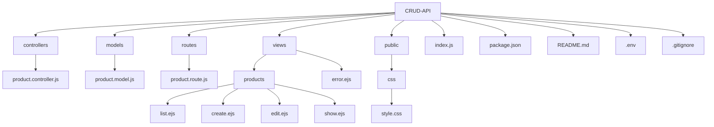

# CRUD-API Project

## Description

This project is a robust CRUD (Create, Read, Update, Delete) API built with Node.js, Express, and MongoDB. It provides a comprehensive implementation for managing product data with a web interface using EJS templates.

## Features

- RESTful API endpoints for product management
- Web interface for interacting with the API
- MongoDB integration for data persistence
- EJS templating for server-side rendering
- Proper error handling and validation

## Technologies Used

- Node.js
- Express.js
- MongoDB
- Mongoose
- EJS (Embedded JavaScript templating)

## Prerequisites

Before you begin, ensure you have met the following requirements:

- Node.js installed (version 12.x or higher)
- MongoDB installed and running

## Installation

1. Clone the repository:

   ```
   git clone https://github.com/aytekinkaplan/CRUD-API.git
   ```

2. Navigate to the project directory:

   ```
   cd CRUD-API
   ```

3. Install the dependencies:

   ```
   npm install
   ```

4. Create a `.env` file in the root directory and add your MongoDB connection string:
   ```
   MONGODB_URI=mongodb://localhost:27017/crud-api
   ```

## Usage

1. Start the server:

   ```
   npm start
   ```

   or for development with nodemon:

   ```
   npm run dev
   ```

2. Open your web browser and navigate to `http://localhost:3000`

3. Use the web interface to create, read, update, and delete products.

## Project Structure

Below is a visual representation of the project structure:



This diagram shows the main directories and files in the project:

- `controllers/`: Contains the logic for handling requests and responses
- `models/`: Defines the data structure and schema for the MongoDB documents
- `routes/`: Defines the API endpoints and connects them to the controllers
- `views/`: Contains the EJS templates for rendering the web interface
- `public/`: Stores static assets like CSS files
- Root files: Configuration files and the main application entry point

## Code Snippets

### Product Model (models/product.model.js)

```javascript
const mongoose = require("mongoose");

const ProductSchema = new mongoose.Schema(
  {
    name: {
      type: String,
      required: [true, "Please enter product name"],
      trim: true,
      maxLength: [100, "Product name cannot exceed 100 characters"],
    },
    quantity: {
      type: Number,
      required: [true, "Please enter product quantity"],
      min: [0, "Quantity cannot be negative"],
    },
    price: {
      type: Number,
      required: [true, "Please enter product price"],
      min: [0, "Price cannot be negative"],
    },
  },
  {
    timestamps: true,
  }
);

module.exports = mongoose.model("Product", ProductSchema);
```

### Product Controller (controllers/product.controller.js)

```javascript
const Product = require("../models/product.model");

module.exports = {
  getAllProducts: async () => {
    try {
      return await Product.find({});
    } catch (error) {
      throw new Error("Failed to fetch products: " + error.message);
    }
  },

  getProduct: async (id) => {
    if (!id) throw new Error("Product ID is required");
    try {
      const product = await Product.findById(id);
      if (!product) {
        throw new Error("Product not found");
      }
      return product;
    } catch (error) {
      if (error.name === "CastError") {
        throw new Error("Invalid product ID");
      }
      throw new Error("Failed to fetch product: " + error.message);
    }
  },

  // ... other methods (create, update, delete)
};
```

### Product Routes (routes/product.route.js)

```javascript
const express = require("express");
const router = express.Router();
const {
  getAllProducts,
  getProduct,
  create,
  update,
  delete: deleteProduct,
} = require("../controllers/product.controller");

router.get("/", async (req, res) => {
  try {
    const products = await getAllProducts();
    res.render("products/list", { products });
  } catch (error) {
    res
      .status(500)
      .render("error", { error: "Failed to fetch products: " + error.message });
  }
});

// ... other routes

module.exports = router;
```

## API Endpoints

- GET `/products` - Retrieve all products
- GET `/products/:id` - Retrieve a specific product
- POST `/products` - Create a new product
- PUT `/products/:id` - Update an existing product
- DELETE `/products/:id` - Delete a product

## Contributing

Contributions to this project are welcome. Please follow these steps:

1. Fork the repository
2. Create a new branch (`git checkout -b feature/AmazingFeature`)
3. Make your changes
4. Commit your changes (`git commit -m 'Add some AmazingFeature'`)
5. Push to the branch (`git push origin feature/AmazingFeature`)
6. Open a Pull Request

## License

This project is licensed under the MIT License - see the [LICENSE](LICENSE) file for details.

## Contact

Aytekin Kaplan - [@ytknkpln](https://twitter.com/ytknkpln) - ytknkpln@gmail.com
